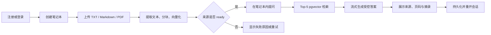
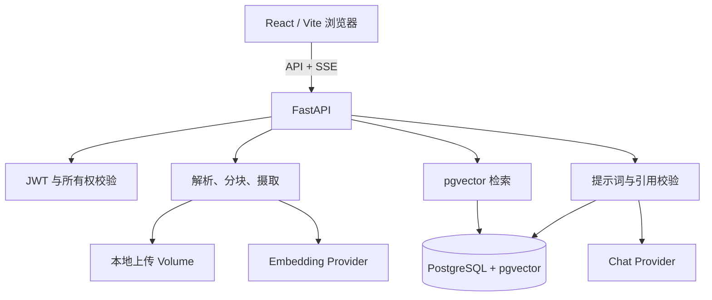

# NoteLLM

> 面向个人学习与研究的、带可追溯引用的文档问答系统。

NoteLLM 是一个参考 Google NotebookLM 核心体验实现的毕业设计原型：用户将课程讲义、研究资料或笔记放入笔记本，在限定资料范围内提问，系统通过检索增强生成（RAG）给出答案，并展示答案所依据的来源、PDF 页码（适用时）和原文摘录。

它的重点不是成为通用聊天机器人，而是证明一条可演示、可验证、可评估的本地 RAG 闭环。

## 产品能力

| 能力 | 说明 |
| --- | --- |
| 用户与数据隔离 | JWT 登录；笔记本、来源和会话均按 `owner_id` 隔离，跨用户访问返回 `404`。 |
| 笔记本管理 | 创建、浏览、修改与删除个人笔记本；每个笔记本管理独立的资料与会话。 |
| 文档摄取 | 支持 UTF-8 TXT、Markdown 与 PDF；校验文件类型和大小，保存处理状态与失败原因。 |
| 文本解析与分块 | TXT/Markdown 读取文本；PDF 以 PyMuPDF 提取并保留页码。默认按 1,000 字符分块，150 字符重叠。 |
| 向量检索 | 使用 PostgreSQL + pgvector；问题与分块向量以余弦距离在当前笔记本范围内检索 Top-5 证据。 |
| 受控问答 | chat provider 只能依据本轮检索到的分块回答，并且只能引用本轮候选的 chunk ID。 |
| 可验证引用 | 后端过滤未知引用 ID；界面展示来源名、页码（适用时）和稳定摘录。无有效证据时固定回复“资料不足”。 |
| 流式会话 | 通过 Server-Sent Events（SSE）流式呈现答案、引用与完成事件；消息和引用会持久化，刷新后仍可恢复。 |
| 安全删除 | 删除来源时同步删除上传文件、分块和向量；删除笔记本时级联清理其来源与会话。 |
| 演示体验 | 工作区提供会话历史、来源处理状态、错误提示和始终可见的退出登录按钮。 |

## 用户流程



## 工作原理



### 可信回答约束

1. 后端只检索当前用户当前笔记本中 `ready` 的来源分块。
2. 上传文本被视为不可信输入，不能覆盖系统的问答规则。
3. 模型只接收本轮检索证据，并以 JSON 返回答案和引用的 chunk ID。
4. 后端只接受属于本轮候选集的引用；未知 ID 会被移除。
5. 没有检索证据或没有有效引用时，系统不输出无依据的正常答案，而是明确说明资料不足。

完整架构与安全边界见 [架构说明](docs/project/ARCHITECTURE.md)。

## 技术栈

- 前端：React 19、TypeScript、Vite、TanStack Router/Query、Tailwind CSS、shadcn/ui
- 后端：FastAPI、SQLModel、Pydantic、Alembic、PyMuPDF
- 数据库与检索：PostgreSQL 18、pgvector、余弦距离 Top-K
- 模型：可独立配置的 OpenAI-compatible chat provider 与 embedding provider
- 工程化：Docker Compose、Bun、uv、pytest、Ruff、mypy、ty

当前示例配置使用 DeepSeek 作为聊天模型接口、智谱 Embedding-3 作为 1024 维 embedding 接口；两者都可通过环境变量替换。密钥永远只由后端读取。

## 快速开始（本地开发）

### 1. 准备配置

```bash
cp .env.example .env
```

编辑本机 `.env`，至少填写：

- 数据库与安全配置：`SECRET_KEY`、`FIRST_SUPERUSER_PASSWORD`、`POSTGRES_PASSWORD`
- 聊天模型：`LLM_BASE_URL`、`LLM_API_KEY`、`LLM_MODEL`
- 嵌入模型：`EMBEDDING_BASE_URL`、`EMBEDDING_API_KEY`、`EMBEDDING_MODEL`

`EMBEDDING_DIMENSIONS` 必须与嵌入模型及数据库迁移一致；当前默认值为 `1024`。不要提交 `.env`、模型密钥或真实上传资料。

### 2. 启动数据库并迁移

```bash
docker compose up -d db
cd backend
POSTGRES_PORT=5433 uv run alembic upgrade head
```

项目使用 `pgvector/pgvector:pg18` 镜像。可检查向量扩展：

```bash
docker compose exec db psql -U postgres -d app -c \
  "SELECT extname, extversion FROM pg_extension WHERE extname = 'vector';"
```

### 3. 启动后端与前端

在两个终端分别运行：

```bash
cd backend
POSTGRES_PORT=5433 uv run fastapi dev app/main.py
```

```bash
bun run --filter frontend dev
```

打开：

- 产品界面：<http://localhost:5173>
- OpenAPI 文档：<http://localhost:8000/docs>

注册账户后，创建笔记本、上传资料，等来源状态显示为 `ready`，再新建会话提问。浏览器会保留登录会话；需要切换账户时可使用工作区右上角的“退出登录”。

## 一键导入合成演示资料

仓库提供不含个人信息的演示 Markdown。先在网页注册一个本地账户，再运行：

```bash
cd backend
POSTGRES_PORT=5433 uv run python scripts/seed_demo.py \
  --email your-local-email@example.com
```

脚本会为指定账户创建“NoteLLM 答辩演示”笔记本并完成向量化；默认不会覆盖已有演示数据。确认重建时再添加 `--replace`。更多演示步骤见 [本地验收指南](docs/project/DEMO.md) 与 [答辩演示脚本](docs/project/DEFENSE_DEMO.md)。

## API 与数据模型

核心实体如下：

```text
User 1 ── * Notebook 1 ── * Source 1 ── * Chunk
                    │
                    └── * Conversation 1 ── * Message 1 ── * Citation
```

主要 API 路径：

| 类别 | 路径示例 | 用途 |
| --- | --- | --- |
| 认证 | `/api/v1/login/access-token` | 获取 JWT 访问令牌。 |
| 笔记本 | `/api/v1/notebooks` | 笔记本 CRUD。 |
| 来源 | `/api/v1/notebooks/{notebook_id}/sources` | 上传、列出、重试和删除来源。 |
| 检索 | `/api/v1/notebooks/{notebook_id}/search` | 返回当前笔记本的 Top-K 证据分块。 |
| 会话 | `/api/v1/notebooks/{notebook_id}/conversations` | 创建和读取会话。 |
| 流式问答 | `/api/v1/conversations/{conversation_id}/messages/stream` | SSE 返回答案增量、引用和完成事件。 |

以正在运行的 `/docs` 为准获取完整请求与响应模型；前端客户端由后端 OpenAPI Schema 生成，不手工修改 `frontend/src/client/`。

## 质量与评测

### 自动化检查

```bash
cd backend
POSTGRES_PORT=5433 uv run pytest -q
uv run ruff check app scripts
uv run mypy app scripts
uv run ty check app scripts
cd ..
bun run --filter frontend build
```

后端测试使用假 provider，不消耗模型额度或依赖网络；覆盖数据隔离、上传/分块失败、pgvector 排序、引用映射和 SSE 事件序列。

### 固定 RAG 评测

评测集包含 7 份合成 Markdown 资料和 34 个固定问题，可通过以下命令复跑：

```bash
cd backend
POSTGRES_PORT=5433 uv run python scripts/evaluate_retrieval.py \
  --with-answers \
  --report ../docs/evaluation/latest-results.md
```

脚本会创建临时用户、笔记本、来源与文件副本，结束时全部清理。最近一次已提交结果：

| 指标 | 结果 |
| --- | ---: |
| Recall@5 | 100.0% |
| 自动引用来源匹配 | 97.1% |
| 关键词忠实度筛查 | 88.2% |
| 检索平均 / P95 | 339 ms / 894 ms |
| 回答平均 / P95 | 2904 ms / 5595 ms |

自动引用来源匹配只检查有效引用是否命中标注来源；关键词筛查不能替代人工忠实度判断。逐题答案、已验证引用来源和人工审核栏位见 [评测报告](docs/evaluation/latest-results.md)，方法说明见 [评测说明](docs/evaluation/README.md)。

## 项目范围

NoteLLM 当前是毕业设计 MVP，刻意不包含多人实时协作、网页爬取、OCR、复杂表格/图片理解、音频概览、移动端、消息队列、多模型容灾或大规模生产运维。优先目标是一个可靠的“上传资料 → 检索 → 带引用回答 → 重开会话”的完整闭环。

## 项目文档

- [产品目标与验收标准](docs/project/GOAL.md)
- [实施计划与当前进度](docs/project/PLAN.md)
- [架构与安全边界](docs/project/ARCHITECTURE.md)
- [API 与界面流程](docs/project/API_AND_UX.md)
- [本地验收与演示](docs/project/DEMO.md)
- [答辩演示脚本](docs/project/DEFENSE_DEMO.md)
- [固定评测集与结果](docs/evaluation/README.md)
