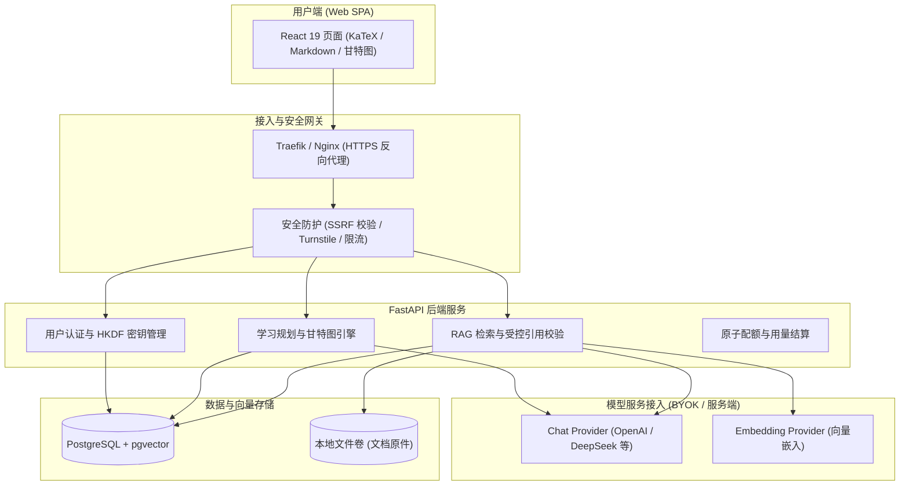

<div align="center">

# 基于 FastAPI 与 RAG 的个人学习问答系统设计与实现

**NoteLLM · Design and Implementation of Personal Learning Q&A System Based on FastAPI and RAG**

*让个人资料中的每一个回答可溯源、可验证，并一键转化为可落地的学习甘特图与每日行动计划。*

[](https://github.com/au1bhi/NoteLLM/actions/workflows/test-backend.yml)
[](https://github.com/au1bhi/NoteLLM/actions/workflows/test-docker-compose.yml)
[](LICENSE)
[](https://www.python.org/)
[](https://fastapi.tiangolo.com/)
[](https://react.dev/)
[](https://github.com/pgvector/pgvector)

[🌐 在线演示](https://notellm.au1bhi.com) · [✨ 核心特性](#-核心特性) · [🏗️ 架构与安全](#️-系统架构与安全体系) · [🚀 快速开始](#-快速开始) · [📊 实验与评测](#-实验与评测结果) · [📄 毕业设计与开源价值](#-毕业设计与开源价值)

---

</div>

## 💡 为什么选择 NoteLLM？

通用大语言模型回答迅速，但在个人学习与严谨学术场景中常面临三大痛点：**缺少权威出处、存在事实幻觉、以及知识无法直接转化为行动**。

**NoteLLM**（启发自 Google NotebookLM）提供了一个完整的个人知识库与学习执行闭环：
1. **真实可信**：支持 PDF、Markdown、TXT 资料解析与分块索引，问答严格匹配原文片段、出处与页码，证据不足主动说明；
2. **多模式问答**：支持 `资料可信模式 (Grounded)`、`混合补充模式 (Hybrid)`、`自由问答模式 (Knowledge)` 自由切换；
3. **学习闭环**：通过对话一键生成 3~60 天学习计划与**交互式甘特图**，自动规划难度、阶段任务、每日耗时与验收标准；
4. **自备算力 (BYOK)**：支持自带 OpenAI 兼容的第三方大模型与 Embedding API（如 DeepSeek、通义千问、Kimi 等），密钥强加密存储，保护隐私与额度自由；
5. **轻量极速**：专为单机与轻量云服务器（1GB/2GB 内存 VPS）深度优化，提供免构建热更与预编译静态资源注入方案。

---

## ✨ 核心特性

| 模块 | 特性说明 |
| :--- | :--- |
| 📚 **笔记本与资料摄取** | 支持创建多个独立笔记本，上传并解析 PDF / TXT / MD 文档，多用户数据严格隔离。 |
| 🔍 **高精度向量检索** | 基于 `PostgreSQL + pgvector` 进行余弦相似度检索，支持来源过滤与元数据精准关联。 |
| 💬 **多会话与可信问答** | 下拉框便捷切换会话；流式输出带精准数字角标与折叠式**原文摘录/页码引用**。 |
| 📅 **智能甘特图与计划** | 从对话提炼结构化学习路径，支持在时间轴/流水线/任务列表查看进度，支持 **AI 自然语言交互调整** 与拖拽编辑。 |
| 🧮 **LaTeX 与 Markdown 增强** | 完美渲染行内 `$E=mc^2$` 与独立块 `$$\sum$$` KaTeX 公式，代码块配备语言徽章与**一键复制代码**。 |
| 🔔 **每日学习邮件提醒** | 可选每日上午 09:00 推送当日学习任务清单（仅对已完成邮箱验证的用户生效）。 |
| 🛡️ **企业级安全基线** | 具备 IDOR 越权强隔离、SSRF 防护（防 DNS Rebinding / 私网拦截）、Turnstile 人机验证、分布式限流、原子配额预留。 |

---

## 🏗️ 系统架构与安全体系


```mermaid
flowchart TB
    subgraph Client["用户端 (Web SPA)"]
        UI["React 19 页面 (KaTeX / Markdown / 甘特图)"]
    end

    subgraph Gateway["接入与安全网关"]
        Traefik["Traefik / Nginx (HTTPS 反向代理)"]
        SecFilter["安全防护 (SSRF 校验 / Turnstile / 限流)"]
    end

    subgraph Backend["FastAPI 后端服务"]
        Auth["用户认证与 HKDF 密钥管理"]
        RAG["RAG 检索与受控引用校验"]
        PlanEngine["学习规划与甘特图引擎"]
        Usage["原子配额与用量结算"]
    end

    subgraph Storage["数据与向量存储"]
        PG[("PostgreSQL + pgvector")]
        DataVolume[("本地文件卷 (文档原件)")]
    end

    subgraph ModelLayer["模型服务接入 (BYOK / 服务端)"]
        LLM["Chat Provider (OpenAI / DeepSeek 等)"]
        Embed["Embedding Provider (向量嵌入)"]
    end

    UI --> Traefik
    Traefik --> SecFilter
    SecFilter --> Auth
    SecFilter --> RAG
    SecFilter --> PlanEngine
    RAG --> PG
    PlanEngine --> PG
    Auth --> PG
    RAG --> DataVolume
    RAG --> LLM
    RAG --> Embed
    PlanEngine --> LLM
```

---

## 🚀 快速开始

### 方式一：远程一键安装（推荐，全自动部署）

无需预先克隆仓库，在 Linux 服务器终端直接运行：

```bash
bash <(curl -Ls https://raw.githubusercontent.com/au1bhi/NoteLLM/master/install.sh)
```

> **国内服务器加速**：
> ```bash
> bash <(curl -Ls https://codeload.github.com/au1bhi/NoteLLM/tar.gz/refs/heads/master | tar -xzO NoteLLM-master/install.sh)
> ```

脚本会自动检测系统内存、网络连通性、引导生成 `.env` 配置，并一键启动全套容器服务。

---

### 方式二：本地克隆与开发运行

```bash
# 1. 克隆仓库
git clone https://github.com/au1bhi/NoteLLM.git
cd NoteLLM

# 2. 交互式本地开发安装
bash install.sh --local

# 3. 启动开发热更模式
docker compose watch
```

* 本地前端访问地址：`http://localhost:5173`
* 本地后端 API 文档：`http://localhost:8000/docs`

---

## 💡 轻量服务器（VPS）低内存部署优化

在 1核 1GB / 2GB 内存的低配 VPS 上，直接运行 Node/Bun 进行前端构建往往会因内存不足而触发 OOM 崩溃。NoteLLM 支持**低内存免构建部署模式**：

```
┌─────────────────────────────────────────────────────────────┐
│ 本地 / CI 环境                                               │
│   1. bun run build -> 生成静态 dist 产物                      │
│   2. 导出 frontend-dist.tar.gz 压缩包                        │
└──────────────────────────────┬──────────────────────────────┘
                               │
            ┌──────────────────┴──────────────────┐
            ▼ (私有部署 / 持续集成)                  ▼ (开源发布)
┌───────────────────────────────┐     ┌───────────────────────────────┐
│ 数据卷直接注入 / SFTP 部署      │     │ 随 GitHub Release 自动分发    │
│ 直接解包至 Nginx 静态数据卷   │     │ install.sh 自动下载预编译包   │
└───────────────┬───────────────┘     └───────────────┬───────────────┘
                │                                     │
                ▼                                     ▼
┌─────────────────────────────────────────────────────────────┐
│ 线上轻量 VPS 服务器 (1GB/2GB 内存)                            │
│   ✔ 零内存编译压力：直接使用轻量 Nginx 提供静态服务          │
│   ✔ 代码卷热挂载：后端秒级热更，无需重新构建镜像            │
└─────────────────────────────────────────────────────────────┘
```

* **低内存模式启动**：`bash install.sh --low-mem`（或由脚本根据系统内存自动选择）；
* **本地打包产物生成**：运行 `bash scripts/build-frontend-dist.sh` 即可快速生成 `frontend-dist.tar.gz` 与校验文件；
* **后端免构建热更**：后端 Python 代码挂载在容器卷中，`git pull` 后运行 `docker compose restart backend` 即可秒级生效。

---

## 📊 实验与评测结果

系统内置了标准 RAG 评测集（包含 7 份合成资料与 34 个复杂学术问答）：

| 评测维度 | 评测指标 | 测试表现 |
| :--- | :--- | :---: |
| **检索精准度** | Top-5 召回率 (Recall@5) | **100.0%** |
| **引用可信度** | 自动引用来源匹配率 (Source Precision) | **97.1%** |
| **事实忠实度** | 人工逐题复核通过率 (Faithfulness) | **34 / 34 (100%)** |
| **响应时延** | 检索平均时延 / P95 | **339 ms / 894 ms** |
| **生成时延** | 问答生成平均时延 / P95 | **2904 ms / 5595 ms** |

*详细评测基准、合成语料与逐题人工复核报告参见 [评测说明文档](docs/evaluation/README.md) 与 [最新报告](docs/evaluation/latest-results.md)。*

---

## 📄 毕业设计与开源价值

* **学术价值**：围绕“大模型幻觉抑制”、“受控出处生成”、“动态学习计划转化”构建了完整的论文级工程闭环；
* **可复用性**：提供解耦的 Provider 接口，完全兼容市面上所有 OpenAI 格式的云端模型与本地 Ollama / vLLM 实例；
* **测试完备性**：包含 **275+ 单元与集成测试**，后端覆盖率达 **84%**，具备完整的 GitHub Actions CI 自动化质量门禁；
* **开箱即用**：自带基于 OKLCH 色域的纸墨（Kraft/Ink）护眼设计，无缝支持移动端/桌面端响应式交互。

---

## 🛠️ 技术栈

* **后端框架**：Python 3.12+ / 3.14 · FastAPI · SQLModel · Pydantic v2 · Alembic
* **向量检索**：PostgreSQL · pgvector · Cosine Similarity Index
* **前端架构**：React 19 · Vite · TypeScript · Tailwind CSS v4 · Radix UI · Lucide Icons
* **图表与排版**：KaTeX (LaTeX 公式) · 自定义 SVG 甘特图 · React-Markdown
* **运维与部署**：Docker · Docker Compose · Traefik · Nginx · Cloudflare Tunnel

---

## 📜 开源许可证

本项目基于 [MIT License](LICENSE) 协议开源。欢迎提交 Issue 与 Pull Request 共同改进！
