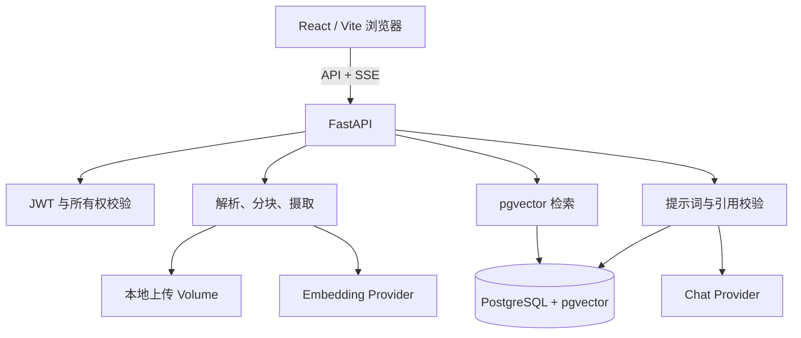
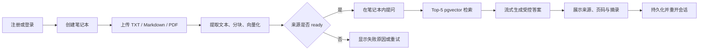

<div align="center">

# 🎓 NoteLLM

**基于检索增强生成（RAG）的带可追溯引用文档问答系统**

一个参考 Google NotebookLM 核心体验的毕业设计原型：把课程讲义、研究资料与笔记放进"笔记本"，在限定资料范围内提问，系统检索证据、流式生成回答，并展示答案所依据的来源、页码与原文摘录——**每一个结论都可回溯、可验证、可评估**。

`Python` `FastAPI` `React 19` `PostgreSQL + pgvector` `RAG`

[快速开始](#-快速开始一键安装) · [系统设计](#-系统总体设计) · [关键问题与方案](#-关键技术与问题方案) · [实验评估](#-实验与评估) · [安全加固](#-安全加固) · [参考文献](#-参考文献)

</div>

---

## 📖 摘要

> **研究背景**：大语言模型（LLM）在知识密集型问答中常产生"幻觉"，回答缺乏可核验的出处，难以用于学术研究与知识管理。检索增强生成（Retrieval-Augmented Generation, RAG）通过"先检索、后生成"将模型输出锚定在外部文档上，是缓解幻觉的主流技术路线；Google NotebookLM 进一步将"个人资料库内的可信问答"产品化。
>
> **研究目标**：面向个人学习与研究场景，设计并实现一个端到端的 RAG 文档问答系统，重点解决三个问题——**(1) 回答可信性**：答案必须基于用户资料库中的证据并可追溯来源；**(2) 多租户数据隔离**：每位用户的笔记本、资料与会话严格隔离；**(3) 服务可用性与防滥用**：在多用户共享服务端模型额度的场景下，通过邮箱身份规范化、原子化配额预留与安全加固，防止额度农场与越权攻击。
>
> **实验结果**：固定评测集（7 份资料、34 题）上 Recall@5 达 **100%**、自动引用来源匹配 **97.1%**；经 8 轮红蓝队对抗与活体安全测试，红队收敛为零发现。

**关键词**：检索增强生成；大语言模型；向量检索；可信引用；多租户隔离；安全加固

---

## ✨ 功能特性

| 能力 | 说明 |
| --- | --- |
| 用户与数据隔离 | JWT 登录；笔记本、来源和会话均按 `owner_id` 隔离，跨用户访问返回 `404`。 |
| 笔记本管理 | 创建、浏览、修改与删除个人笔记本；每个笔记本管理独立的资料与会话。 |
| 文档摄取 | 支持 UTF-8 TXT、Markdown 与 PDF；校验文件类型和大小，保存处理状态与失败原因。 |
| 文本解析与分块 | TXT/Markdown 读取文本；PDF 以 PyMuPDF 提取并保留页码。默认按 1,000 字符分块、150 字符重叠。 |
| 向量检索 | 使用 PostgreSQL + pgvector；问题与分块向量以余弦距离在当前笔记本范围内检索 Top-5 证据。 |
| 受控问答 | chat provider 只能依据本轮检索到的分块回答，并且只能引用本轮候选的 chunk ID。 |
| 可验证引用 | 后端过滤未知引用 ID；界面展示来源名、页码（适用时）和稳定摘录。无有效证据时固定回复"资料不足"。 |
| 流式会话 | 通过 Server-Sent Events（SSE）流式呈现答案、引用与完成事件；消息和引用持久化，刷新后可恢复。 |
| 自备密钥（BYOK） | 每个用户可在"设置 → 模型配置"填入自己的对话/嵌入 API Key（OpenAI 兼容），Fernet 加密存储、只回传掩码。 |
| 免费额度 | 服务端计费用量按自然月统计：对话 10 万 token、嵌入 30 万字符；原子化"预留—结算"拦截并发与单次超大上传。 |
| 新手引导 | 首页"快速上手"引导（配置模型 → 创建笔记本 → 上传资料 → 提问），完成状态实时打勾、可关闭。 |
| 全屏防截图水印 | 所有页面叠加可配置的平铺水印，双层冗余，经红蓝队对抗验证不可绕过。 |

---

## 🚀 快速开始（一键安装）

前置条件：已安装 Docker 与 Docker Compose。**复制粘贴这一行即可**（3x-ui 风格，无需先克隆仓库）：

```bash
bash <(curl -Ls https://raw.githubusercontent.com/au1bhi/NoteLLM/master/install.sh)
```

> **大陆服务器**：`raw.githubusercontent.com` 常被墙。改用 codeload 源码包形式（服务器实测可达）：
>
> ```bash
> bash <(curl -Ls https://codeload.github.com/au1bhi/NoteLLM/tar.gz/refs/heads/master | tar -xzO NoteLLM-master/install.sh)
> ```
>
> 两种形式内部都会在 `git clone` 失败（github.com 不可达）时自动改用 codeload 源码包兜底，`NOTELLM_DIR` 指定安装目录（默认 `~/NoteLLM`）。

脚本会自动把仓库克隆/更新到 `~/NoteLLM`（可用 `NOTELLM_DIR` 覆盖）并进入交互式向导。重复运行同一命令即为"更新 + 重装"。也可以在仓库内直接运行：

```bash
bash install.sh                # 交互式安装（本地开发 / 生产部署二选一）
bash install.sh --local --yes  # 本地全自动：默认值 + 自动生成密钥
DOMAIN=example.com bash install.sh --prod --yes   # 生产全自动：只填域名
bash install.sh --dry-run      # 只生成 .env 并预览命令，不实际启动
bash install.sh --help         # 查看全部选项
```

- **本地开发**：选 `1`（本地）后一路回车。向导自动生成安全密钥并构建启动，完成后打开 <http://localhost:5173>，用输出中的管理员邮箱/密码登录。
- **生产部署**：选 `2`（生产）后填写域名。向导自动生成 `.env`（权限 600）、创建 `traefik-public` 网络、签发 HTTPS 证书并启动。所有密钥自动生成，只有 Let's Encrypt 通知邮箱（不填自动用 `admin@域名`）与 SMTP 密钥（可选）需要你提供。
- **国内服务器**：自动探测 Docker Hub 连通性，不通则内置镜像加速引导（`REGISTRY_MIRROR`），并默认配置 pip / npm 国内镜像。

### 低内存服务器（≤2GB）：前端构建优化

前端 SPA 的构建（`bun install` + `vite build`）需要约 2GB 内存，在 1–2GB 的小服务器上会被内核 OOM 杀掉。`install.sh` 会**自动检测内存**并在不足时启用**低内存模式**（也可用 `--low-mem` / `--no-low-mem` 强制开关）：

- `frontend` 服务改用**纯 nginx 镜像**（`frontend/Dockerfile.nginx`），不在服务器上跑任何前端构建；
- SPA 由**预构建产物**注入 `frontend-dist` 卷，来源依次为：`FRONTEND_DIST_URL` → 仓库内 `frontend-dist.tar.gz` → **GitHub Release** 的 `frontend-dist-*` 资产；
- 生成产物请在内存充足的机器（你的电脑或 CI）运行：

```bash
bash scripts/build-frontend-dist.sh      # 产出 frontend-dist.tar.gz
```

之后上传到服务器（放到仓库根目录，或设置 `FRONTEND_DIST_URL`，或发布为 GitHub Release 资产），重跑 `install.sh` 即可注入。后端镜像仍可在服务器上构建（pip 安装，内存占用低）。这种方式把"最吃内存的构建"彻底移出服务器——**服务器只需下载与解包，从不编译前端**。

> 阈值可用 `LOW_MEM_MB` 调整（默认 `2048`）。

---

## 🏗 系统总体设计


```mermaid
flowchart TB
    Browser[React / Vite 浏览器] -->|API + SSE| API[FastAPI]
    API --> Auth[JWT 与所有权校验]
    API --> Ingest[解析、分块、摄取]
    API --> Retrieval[pgvector 检索]
    API --> Answer[提示词与引用校验]
    Ingest --> Files[本地上传 Volume]
    Ingest --> Embedding[Embedding Provider]
    Retrieval --> DB[(PostgreSQL + pgvector)]
    Answer --> DB
    Answer --> Chat[Chat Provider]
```

- **前端**：React 19 + TypeScript + Vite + TanStack Router/Query + Tailwind CSS + shadcn/ui，nginx 同源代理 `/api`，无需 CORS。
- **后端**：Python ≥ 3.12 + FastAPI + SQLModel + Pydantic + Alembic，SSE 流式输出。
- **数据与检索**：PostgreSQL 18 + pgvector 扩展，余弦距离 Top-K。
- **模型**：可独立配置的 OpenAI-compatible chat provider 与 embedding provider；默认示例为 DeepSeek 对话 + 智谱 Embedding-3（1024 维），均可通过环境变量替换。

### 数据模型

```text
User 1 ── * Notebook 1 ── * Source 1 ── * Chunk
                    │
                    └── * Conversation 1 ── * Message 1 ── * Citation
```

附加安全数据：`User.email_canonical`（唯一规范邮箱，防额度农场）、`User.email_history`（历史邮箱）、`User.pending_email`（待验证邮箱修改）、`EmailUsageTombstone`（额度墓碑）、`UserUsage`（按月配额计数）、`UserProviderSettings`（加密存储的 BYOK 密钥）。

### 用户流程


```mermaid
flowchart LR
    A[注册或登录] --> B[创建笔记本]
    B --> C[上传 TXT / Markdown / PDF]
    C --> D[提取文本、分块、向量化]
    D --> E{来源是否 ready}
    E -->|是| F[在笔记本内提问]
    E -->|否| G[显示失败原因或重试]
    F --> H[Top-5 pgvector 检索]
    H --> I[流式生成受控答案]
    I --> J[展示来源、页码与摘录]
    J --> K[持久化并重开会话]
```

### 可信回答约束

1. 后端只检索当前用户当前笔记本中 `ready` 的来源分块。
2. 上传文本被视为不可信输入，不能覆盖系统的问答规则（提示词中模型指令以 `system` 角色承载，资料作为 `user` 输入）。
3. 模型只接收本轮检索证据，并以 JSON 返回答案和引用的 chunk ID。
4. 后端只接受属于本轮候选集的引用；未知 ID 会被移除。
5. 没有检索证据或没有有效引用时，系统不输出无依据的正常答案，而是明确说明资料不足。

完整架构与安全边界见 [架构说明](docs/project/ARCHITECTURE.md)。

---

## 🔑 关键技术与问题方案

毕业设计在实践中踩过、并在代码层面闭环解决的几个核心问题：

### 1. 回答可信性：如何让模型"只答资料内的事"？

**问题**：直接让 LLM 回答个人资料会自由发挥，无法溯源。
**方案**：两级约束——检索层把候选分块限定在当前笔记本 `ready` 来源（Top-5，余弦相似度）；生成层让模型只接收本轮证据、以 JSON 返回答案与引用 chunk ID，后端**过滤掉一切未知引用 ID**。无可信证据时固定回复"资料不足"。评测集上自动引用匹配达 97.1%。

### 2. 多租户隔离与反越权

**问题**：多用户共享服务端模型额度，账户间必须严格隔离。
**方案**：JWT + 所有权校验贯穿全部数据访问，跨用户访问返回统一 `404`（不泄露资源存在性）；上传总量上限 100 MiB，删除笔记本/账户时级联清理磁盘文件，不残留孤儿数据。

### 3. 免费额度反滥用：从"改邮箱再删号"到"邮箱身份规范化"

**问题**：服务端免费额度按月发放，攻击者可通过"改邮箱 → 删号 → 重注册旧地址"、Gmail 子地址（`+tag`）/点号变体、大小写变体反复刷新额度。
**方案**（历经 8 轮红蓝队加固）：
- **邮箱身份规范化** `canonical_email`：小写、对所有域名剥离 `+tag`、剥离 Gmail 点号、折叠别名家族（`googlemail→gmail`、`hotmail/live/msn/outlook.*→outlook`、`ymail/rocketmail→yahoo`、`me/mac→icloud`）；
- **`email_canonical` 唯一列**：一个物理邮箱只允许一个存活账户，堵死并发子地址注册；
- **额度墓碑** `EmailUsageTombstone`：删号、**以及任何改邮箱释放地址时**，把已用量写到该邮箱名下，重注册即恢复（月度配额不刷新）。

### 4. 安全加固：红蓝队对抗驱动的防御纵深

对认证、配额、SSRF、令牌生命周期做系统加固，核心防线包括：

- **JWT 密码轮换即时吊销**：令牌携带 `password_changed_at` 微秒快照，改密/重置后所有已签发令牌立即失效；重置令牌因此天然单次使用。
- **邮箱验证用途隔离 + 防枚举**：验证与重置 token 按 `purpose` 隔离；密码找回两个分支都执行 Argon2 假哈希以均衡时序；公开注册/找回返回完全一致的响应体，无法枚举已注册地址。
- **SSRF 防护**：用户提供的模型 Base URL 每次出站前重新解析校验（私有/回环/链路本地/保留/组播/CGNAT/云元数据，含十进制/十六进制/简写 IP 与 IPv4-mapped-IPv6 绕过形式），随后把连接**固定到已校验的公网 IP**（DNS rebinding 阻断）；不读取代理环境变量。
- **令牌生命周期**：重置/验证令牌经 URL fragment（非 query string）传递，读取后立即从地址栏与历史中清除；前端启动即解码 JWT `exp` 本地判过期、401 不重试、过期定时器/焦点检查，杜绝"假下线"。
- **部署加固**：生产关闭 `/docs`；Adminer/Traefik 面板 HTTP Basic Auth 保护；端口全部绑定回环；`SECRET_KEY` 强制 ≥32 字符；CSP/HSTS 等安全响应头。

> 已知取舍：生产以 4 个 worker 运行，认证限流与按收件人的发信冷却为进程内状态（各 worker 独立、按反代解析的真实 IP 计数）。单机部署足够；若需跨进程全局强一致限流，可把 `rate_limit` 的存储换成 Redis（接口不变）。

---

## 🧪 实验与评估

### 固定 RAG 评测

评测集包含 7 份合成 Markdown 资料和 34 个固定问题，可一键复跑：

```bash
cd backend
POSTGRES_PORT=5433 uv run python scripts/evaluate_retrieval.py \
  --with-answers --report ../docs/evaluation/latest-results.md
```

最近一次已提交结果：

| 指标 | 结果 |
| --- | ---: |
| Recall@5 | 100.0% |
| 自动引用来源匹配 | 97.1% |
| 关键词忠实度筛查 | 88.2% |
| 检索平均 / P95 | 339 ms / 894 ms |
| 回答平均 / P95 | 2904 ms / 5595 ms |

逐题答案与人工审核栏位见 [评测报告](docs/evaluation/latest-results.md)，方法说明见 [评测说明](docs/evaluation/README.md)。

### 红蓝队对抗（安全评测）

采用多红队 agent 并行扫描 + 对抗式验证 agent 逐条复核的迭代流程，每轮修复后部署活体复测：

| 轮次 | 发现 | 轮次 | 发现 |
| --- | ---: | --- | ---: |
| 第 1 轮 | 11 | 第 5 轮 | 2 |
| 第 2 轮 | 21 | 第 6 轮 | 1 |
| 第 3 轮 | 19 | 第 7 轮 | 1（SSRF mapped-IPv6 绕过） |
| 第 4 轮 | 9 | 第 8 轮 | **0（收敛）** |

共修复 39+ 类安全根因（邮箱农场、JWT 撤销、SSRF、配额幻觉退款、令牌碰撞、额度墓碑缺口、fragment 令牌残留等）。每次修复均配套回归测试；本地 180+ 自动化测试全绿。

### 自动化检查

```bash
cd backend
POSTGRES_PORT=5433 uv run pytest -q    # 183 个测试（假 provider，不耗模型额度）
uv run ruff check app scripts
uv run mypy app scripts
uv run ty check app scripts
cd ..
bun run --filter frontend build
```

---

## 📮 邮件发送与部署（邮箱验证 / 找回密码）

应用会发送两类邮件：**注册后的邮箱验证**（点击链接确认邮箱归属）与**找回密码**。未配置邮件后端时（`SMTP_HOST` 为空），新注册账户自动视为已验证，仅适合本地开发。

1. 推荐 [Resend](https://resend.com)（免费 3000 封/月）。注册后在 **Domains** 添加发送子域名（例如 `notify.example.com`），按提示配置 SPF / DKIM / DMARC 三条 TXT 记录并等待 Verified。
2. 在 `.env` 填入：

```env
FRONTEND_HOST=https://example.com
SMTP_HOST=smtp.resend.com
SMTP_PORT=587
SMTP_TLS=True
SMTP_USER=resend
SMTP_PASSWORD=<Resend SMTP 密钥>
EMAILS_FROM_EMAIL=no-reply@notify.example.com
EMAILS_FROM_NAME=NoteLLM
# 注册/改邮箱域名白名单（逗号分隔，`*` 放行任意域名）
ALLOWED_EMAIL_DOMAINS=163.com,qq.com,gmail.com,126.com,outlook.com,hotmail.com
```

`SMTP_HOST` 非空即启用邮箱验证：注册即发送含 72 小时有效链接的验证邮件；登录后顶部显示"邮箱尚未验证"横幅可一键重发；未验证账户可登录、可用自带 API Key，但**不能消耗服务端免费额度**。

---

## 🛠 本地开发

### 方式一：一键安装（推荐）

```bash
bash install.sh --local
```

### 方式二：手动

```bash
# 1. 配置
cp .env.example .env        # 填 SECRET_KEY(≥32字符) / FIRST_SUPERUSER_PASSWORD / POSTGRES_PASSWORD / 模型密钥

# 2. 启动数据库并迁移
docker compose up -d db
cd backend
POSTGRES_PORT=5433 uv run alembic upgrade head

# 3. 启动后端与前端（两个终端）
POSTGRES_PORT=5433 uv run fastapi dev app/main.py
# 前端 vite 开发服务器默认同源（BASE=""）；本地开发需把 API 指到后端 :8000：
echo 'VITE_API_URL=http://localhost:8000' > frontend/.env.local   # 已被 git 忽略，也可用环境变量
bun run --filter frontend dev
```

打开：产品界面 <http://localhost:5173>，OpenAPI 文档 <http://localhost:8000/docs>。注册账户后创建笔记本、上传资料，等来源状态为 `ready` 后提问。

一键导入演示资料（不含个人信息）：

```bash
cd backend
POSTGRES_PORT=5433 uv run python scripts/seed_demo.py --email your-local-email@example.com
```

更多演示步骤见 [本地验收指南](docs/project/DEMO.md) 与 [答辩演示脚本](docs/project/DEFENSE_DEMO.md)。

---

## 🧭 项目结构

```text
backend/app/
  api/routes/        # FastAPI 路由（认证/笔记本/会话/用户/用量/设置）
  core/              # 安全核心：JWT、SSRF、限流、配置
  services/          # 业务逻辑：摄取、检索、问答、用量、provider 设置
  models.py          # SQLModel 数据模型
frontend/src/
  routes/            # TanStack Router 页面
  components/        # UI 组件（shadcn/ui + 业务组件）
  services/          # 前端 API 封装
  client/            # 由后端 OpenAPI 自动生成的客户端（勿手改）
install.sh           # 一键安装向导（支持远程执行 / 低内存模式）
compose*.yml         # 编排（生产 Traefik / 本地覆盖 / 低内存前端）
scripts/             # 构建产物、评测、演示、客户端生成脚本
docs/                # 架构、目标、演示、评测文档
```

---

## 🔭 项目范围与展望

NoteLLM 当前是毕业设计 MVP，**刻意不包含**：多人实时协作、网页爬取、OCR、复杂表格/图片理解、音频概览、移动端、消息队列、多模型容灾与大规模生产运维。优先目标是可靠的"上传资料 → 检索 → 带引用回答 → 重开会话"闭环。

**后续展望**：① 引入 reranker / 混合检索（BM25 + 向量）提升召回；② 引用级别忠实度自动评估；③ 跨进程强一致限流（Redis 化）；④ 预构建前端产物的自动化发布（CI 构建 → GitHub Release）。

---

## 🤝 贡献与许可

- 提交规范、开发流程见 [CONTRIBUTING.md](CONTRIBUTING.md) 与 [development.md](development.md)。
- 项目文档：[产品目标与验收标准](docs/project/GOAL.md) · [实施计划](docs/project/PLAN.md) · [架构与安全边界](docs/project/ARCHITECTURE.md) · [API 与界面流程](docs/project/API_AND_UX.md) · [演示与答辩](docs/project/DEMO.md)
- 开源许可：[MIT](LICENSE)

---

## 📚 参考文献

1. Lewis P, Perez E, Piktus A, et al. Retrieval-Augmented Generation for Knowledge-Intensive NLP Tasks[C]. *Advances in Neural Information Processing Systems (NeurIPS)*, 2020. arXiv:2005.11401.
2. Vaswani A, Shazeer N, Parmar N, et al. Attention Is All You Need[C]. *NeurIPS*, 2017. arXiv:1706.03762.
3. Karpukhin V, Oğuz B, Min S, et al. Dense Passage Retrieval for Open-Domain Question Answering[C]. *EMNLP*, 2020. arXiv:2004.04906.
4. Reimers N, Gurevych I. Sentence-BERT: Sentence Embeddings using Siamese BERT-Networks[C]. *EMNLP*, 2019. arXiv:1908.10084.
5. Robertson S, Zaragoza H. The Probabilistic Relevance Framework: BM25 and Beyond[J]. *Foundations and Trends in Information Retrieval*, 2009, 3(4): 333-389.
6. Johnson J, Douze M, Jégou H. Billion-scale Similarity Search with GPUs[J]. *IEEE Transactions on Big Data*, 2019, 7(3): 535-547.
7. Gao Y, Xiong Y, Gao X, et al. Retrieval-Augmented Generation for Large Language Models: A Survey[J]. 2023. arXiv:2312.10997.
8. Devlin J, Chang M W, Lee K, et al. BERT: Pre-training of Deep Bidirectional Transformers for Language Understanding[C]. *NAACL*, 2019. arXiv:1810.04805.
