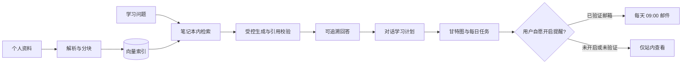

<div align="center">

# 基于FastAPI与RAG的个人学习问答系统设计与实现

**NoteLLM：让个人资料中的每个回答可追溯、可验证，并进一步转化为可执行的学习计划。**

[论文价值](#论文价值) · [开源价值](#开源价值) · [实验结果](#实验结果) · [快速体验](#快速体验)

</div>

## 项目简介

大语言模型能快速回答问题，但在学习场景中，自由生成的内容可能偏离教材、缺少出处，也难以直接转化为持续行动。NoteLLM 面向个人学习与研究，将 PDF、Markdown 和文本资料组织为独立笔记本，通过检索增强生成（RAG）先寻找证据，再生成带来源、页码和原文摘录的回答。

系统还可以把一次对话转化为学习甘特图：自动判断主题难度，安排 3—60 天的学习周期、阶段任务、每日投入时间与验收方式。用户可自行选择是否在每天上午 9:00 接收当日计划；只有已验证邮箱才能开启提醒。

## 论文价值

本项目围绕“可信回答如何真正服务个人学习”展开，形成了可实现、可测量、可复现的毕业设计闭环。

- **可信性研究**：以“笔记本内检索—受控生成—服务端引用校验”约束模型回答；证据不足时明确拒答，而不是补造结论。
- **学习闭环设计**：将资料问答进一步映射为难度、周期、甘特任务、每日时长和成果验收，使系统从知识查询工具扩展为学习执行工具。
- **多用户安全边界**：笔记本、资料、向量、会话、引用和学习计划均按所有者隔离；上传内容被视为不可信输入。
- **可重复实验**：仓库提交固定语料、问题集、评测脚本和逐题结果，能够复跑检索召回、引用匹配、忠实度筛查与响应时间。
- **工程验证**：通过自动化测试、数据库迁移、Docker Compose 和生产部署验证研究方案不只停留在概念层面。

核心研究问题包括：RAG 能否提升个人资料问答的可核验性；后端引用白名单能否抑制伪造出处；对话内容能否稳定转换为可执行学习周期；多用户共享模型服务时如何兼顾隔离、配额与可用性。

## 核心能力

1. 创建个人笔记本，上传 PDF、Markdown 或文本资料。
2. 自动解析、分块、向量化，并在当前笔记本范围内检索证据。
3. 以“仅依据资料、资料 + 已有知识、自由问答”三种模式进行流式对话。
4. 展示并持久化来源、页码和原文摘录，重新打开会话仍可追溯。
5. 从某个会话生成学习甘特图，自动安排难度、周期、详细任务和每日建议时长。
6. 由用户主动开启或关闭每天 9:00 的学习邮件；未验证邮箱不能开启。
7. 支持每位用户配置自己的 OpenAI 兼容模型服务，密钥加密保存且不会返回明文。

## 系统思路


```mermaid
flowchart LR
    A[个人资料] --> B[解析与分块]
    B --> C[(向量索引)]
    Q[学习问题] --> D[笔记本内检索]
    C --> D
    D --> E[受控生成与引用校验]
    E --> F[可追溯回答]
    F --> G[对话学习计划]
    G --> H[甘特图与每日任务]
    H --> I{用户自愿开启提醒?}
    I -->|已验证邮箱| J[每天 09:00 邮件]
    I -->|未开启或未验证| K[仅站内查看]
```

FastAPI 负责认证、资料摄取、检索、模型调用、计划生成与权限校验；PostgreSQL + pgvector 保存业务数据和向量；React 提供笔记本、对话、引用和甘特图界面；独立调度进程发送已主动订阅的每日提醒。

更完整的设计边界见 [架构说明](docs/project/ARCHITECTURE.md)，研究范围与实施证据见 [项目目标](docs/project/GOAL.md) 和 [项目计划](docs/project/PLAN.md)。

## 实验结果

当前固定评测集包含 7 份合成资料和 34 个问题：

| 指标 | 结果 |
| --- | ---: |
| Recall@5 | 100.0% |
| 自动引用来源匹配 | 97.1% |
| 关键词忠实度筛查 | 88.2% |
| 检索平均 / P95 | 339 ms / 894 ms |
| 回答平均 / P95 | 2904 ms / 5595 ms |

以上结果用于验证系统设计。关键词命中率不是人工忠实度：对应这次基线的 34 题已逐题对照摘录，**34 通过 / 0 未通过**，见 [人工复核说明](docs/evaluation/human-faithfulness.md)。评测方法、固定数据和逐题结果分别位于 [评测说明](docs/evaluation/README.md) 与 [最新报告](docs/evaluation/latest-results.md)。不要把 Recall@5 = 100% 写成开放域检索结论，也不要把仓库 `img/` 当作本系统截图。

## 开源价值

- **可复用的 RAG 最小闭环**：提供从上传、分块、向量检索到引用验证与会话持久化的完整参考实现。
- **供应商中立**：聊天模型和嵌入模型都通过 OpenAI 兼容接口接入，适合替换为云服务或自部署模型。
- **研究可复现**：合成评测资料可公开分发，不依赖私有文档，也不会消耗真实用户数据。
- **部署成本友好**：支持 Docker Compose 一键安装；低内存服务器可直接下载 GitHub Release 中预构建的前端产物。
- **安全实践可迁移**：包含资源所有权校验、Turnstile、跨 worker 共享限流、HKDF 分域密钥、配额原子预留、邮箱验证、SSRF 防护和引用白名单等可独立参考的实现。

欢迎围绕检索策略、引用质量评估、学习计划效果评估、无障碍体验和文档改进提交 Issue 或 Pull Request。贡献代码时请为行为变化补充测试，并避免提交密钥或真实上传资料。

## 快速体验

前置条件：Docker 与 Docker Compose。无需预先克隆仓库：

```bash
bash <(curl -Ls https://raw.githubusercontent.com/au1bhi/NoteLLM/master/install.sh)
```

国内网络可从 GitHub codeload 读取同一安装脚本：

```bash
bash <(curl -Ls https://codeload.github.com/au1bhi/NoteLLM/tar.gz/refs/heads/master | tar -xzO NoteLLM-master/install.sh)
```

也可以克隆后运行：

```bash
cp .env.example .env
bash install.sh --local
```

`install.sh` 会引导生成必要配置。生产环境如需邮箱验证、找回密码和可选学习提醒，需要配置 SMTP；未配置时不会发送邮件。详细参数以 `bash install.sh --help`、[.env.example](.env.example) 和 [生产部署指南](deployment.md) 为准。

## 开发与验证

```bash
docker compose watch

cd backend
bash scripts/lint.sh
bash scripts/test.sh

cd ..
bun run --filter frontend build
bun run lint
```

测试使用模拟模型，不需要真实 API Key，也不会产生模型费用。前端 API 客户端由后端 OpenAPI 自动生成，请勿直接修改生成文件。

## 项目边界

NoteLLM 是面向毕业设计与个人部署的研究型开源项目，重点是一个可靠的端到端学习闭环。当前不以多人协作、超大规模并发、OCR、复杂表格理解或移动端原生应用为目标。

## 许可证

本项目采用 [MIT License](LICENSE)。
