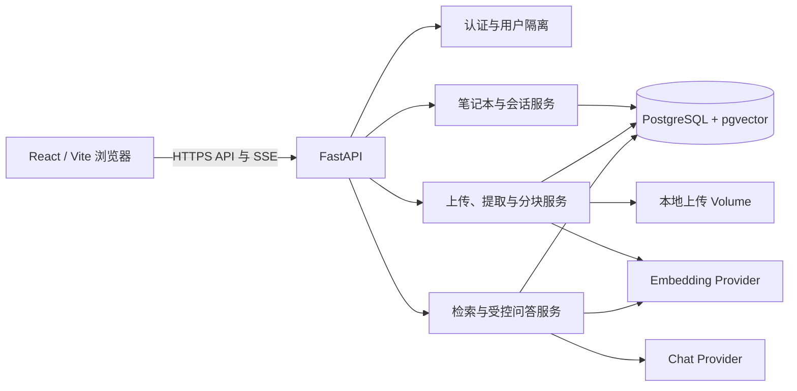

# NoteLLM MVP 架构

## 一次问答的数据流

1. 浏览器携带用户访问令牌请求笔记本、来源或会话；后端从 `Notebook.owner_id` 验证归属。
2. 上传的 TXT、Markdown 或 PDF 保存到本地 volume，后端提取文本并以 1,000 字符、150 字符重叠分块。
3. 后端调用 embedding provider 写入 1024 维向量；只有 `ready` 来源的非空向量会被检索。
4. 提问时后端在当前笔记本内以 pgvector cosine distance 取 Top-5 分块，把原文作为不可信证据构造提示词。
5. chat provider 返回 JSON 答案与候选 chunk ID；后端只保留本次检索集合中的引用，写入 `Message` 与 `Citation`，再通过 SSE 发送答案、引用与完成事件。

## 安全边界

- provider 密钥仅由后端从环境变量读取，浏览器不会获得密钥或直接调用模型。
- 上传资料被视为不可信文本，不能覆盖后端的系统指令或决定引用。
- 所有笔记本范围的查询都按当前用户过滤；跨用户对象返回 404。
- 删除来源会删除文件、分块和向量；删除笔记本会级联清理来源与会话数据。

## 可复现实验边界

评测语料位于 `docs/evaluation/sources/`，均为合成资料。`backend/scripts/evaluate_retrieval.py` 会建立临时用户和笔记本、运行检索/问答后清理数据库记录与文件；因此不需要也不应将任何真实上传资料放入仓库。
