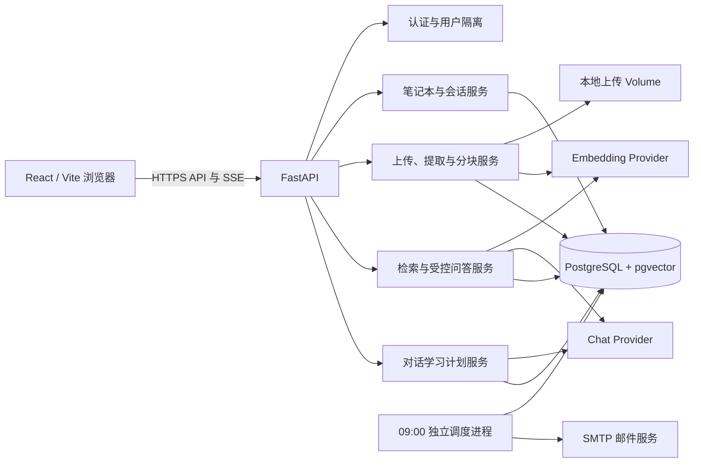

# NoteLLM MVP 架构

```mermaid
flowchart LR
    Browser[React / Vite 浏览器] -->|HTTPS API 与 SSE| API[FastAPI]
    API --> Auth[认证与用户隔离]
    API --> Notebook[笔记本与会话服务]
    API --> Ingest[上传、提取与分块服务]
    API --> Answer[检索与受控问答服务]
    API --> Plan[对话学习计划服务]
    Scheduler[09:00 独立调度进程] --> DB
    Scheduler --> Mail[SMTP 邮件服务]
    Ingest --> Files[本地上传 Volume]
    Ingest --> Embed[Embedding Provider]
    Answer --> Embed
    Answer --> Chat[Chat Provider]
    Notebook --> DB[(PostgreSQL + pgvector)]
    Ingest --> DB
    Answer --> DB
    Plan --> Chat
    Plan --> DB
```

## 一次问答的数据流

1. 浏览器携带用户访问令牌请求笔记本、来源或会话；后端从 `Notebook.owner_id` 验证归属。
2. 上传的 TXT、Markdown 或 PDF 保存到本地 volume，后端提取文本并以 1,000 字符、150 字符重叠分块。
3. 后端调用 embedding provider 写入 1024 维向量；只有 `ready` 来源的非空向量会被检索。
4. 提问时后端在当前笔记本内以 pgvector cosine distance 取 Top-5 分块，把原文作为不可信证据构造提示词。
5. chat provider 返回 JSON 答案与候选 chunk ID；后端只保留本次检索集合中的引用，写入 `Message` 与 `Citation`，再通过 SSE 发送答案、引用与完成事件。

## 学习计划与提醒数据流

1. 用户从自己的某个会话请求生成计划；后端截取最近的对话上下文，并把对话内容作为不可信输入交给 chat provider。
2. 模型返回难度、3—60 天周期和阶段任务；后端校验范围、补齐未覆盖日期，并保存为一份会话级 `StudyPlan` 与多个 `StudyTask`。
3. 浏览器按实际日期绘制甘特图；侧边栏「甘特图」通过 `GET /api/v1/study-plans` 聚合当前用户全部会话计划到同一条时间轴。任务完成状态单独持久化；重新生成会替换任务，但保留用户的提醒选择。
4. 邮件提醒默认关闭。只有服务器 SMTP 可用且账户邮箱已验证时，用户才能主动开启。
5. 独立 scheduler 按计划的 IANA 时区在每天 09:00 选择当日未完成任务；数据库原子认领 `last_reminder_date`，避免重启或并发造成重复发送。

## 安全边界

- provider 密钥仅由后端从环境变量读取，浏览器不会获得密钥或直接调用模型。
- 上传资料被视为不可信文本，不能覆盖后端的系统指令或决定引用。
- 所有笔记本范围的查询都按当前用户过滤；跨用户对象返回 404。
- 删除来源会删除文件、分块和向量；删除笔记本会级联清理来源与会话数据。
- 学习计划经会话回溯到 `Notebook.owner_id`；未验证邮箱不能开启提醒，计划文本在进入 HTML 邮件前转义。

## 可复现实验边界

评测语料位于 `docs/evaluation/sources/`，均为合成资料。`backend/scripts/evaluate_retrieval.py` 会建立临时用户和笔记本、运行检索/问答后清理数据库记录与文件；因此不需要也不应将任何真实上传资料放入仓库。
