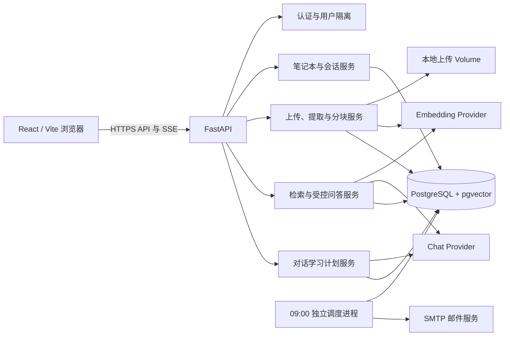

# 第 3 章　系统设计（粘贴用草稿）

> 用法：转绘本仓库已有图，不要另画一套微服务。架构 mermaid 见 `docs/project/ARCHITECTURE.md`，实体关系见 `docs/project/DESIGN.md`，接口表见 `docs/project/API_AND_UX.md`。截图按 [`SCREENSHOTS.md`](SCREENSHOTS.md) 本机捕获。

## 3.1 总体架构

浏览器经 HTTPS API 与 SSE 访问 FastAPI。后端按职责拆成认证与用户隔离、笔记本与会话、上传提取分块、检索与受控问答、对话学习计划；它们仍在**同一个**进程里，不是独立微服务。独立 scheduler 只按计划的 IANA 时区在每天本地 09:00 投递已订阅提醒，不承担问答。向量与业务行同在 PostgreSQL + pgvector；上传文件落在应用源码树以外的本地 Docker Volume。

论文插图 3-1 转绘下面这张图即可，不要改成「网关 + 检索服务 + 生成服务」。



选用同库向量而不是独立向量服务，是为了让本科复现只维护一套 Compose。密钥只存在后端环境变量或加密后的用户 BYOK 字段；浏览器不持有供应商密钥，也不直接调用模型。

## 3.2 一次问答数据流

1. 浏览器携带访问令牌请求笔记本、来源或会话；后端从 `Notebook.owner_id` 校验归属，失败统一 404。
2. 上传的 TXT、Markdown 或 PDF 写入本地 volume；后端提取文本，按默认 1 000 字符、150 字符重叠分块。
3. 嵌入写入 1024 维向量。只有状态为 `ready` 且向量非空的分块会进入检索。
4. 提问时在**当前笔记本**内按 pgvector cosine distance 取 Top-5（接口允许 1—10），把原文当作不可信证据构造提示词。系统规则走 `system`，资料与问题走 `user`。
5. 聊天模型返回 JSON：`answer` 加候选 `chunk_id`。后端只保留本轮检索集合中的 ID，写入 `Message` 与 `Citation`，再经 SSE 依次推送 `delta`、`citations`、`done`。

学习计划不走这条提问链。生成入口是会话上的 `POST /study-plan`：截取最近 30 条、至多 16 000 字对话，模型给出难度与 3—60 天任务，后端校验后落库。侧边栏 `/gantt` 只读 `GET /api/v1/study-plans`，把当前用户全部计划画在同一条时间轴上，**不会**自己生成计划。

## 3.3 数据模型

所有标识为 UUID，时间戳为 UTC。删除父实体级联清理子实体与派生文件 / 向量。

```text
User 1 ── * Notebook 1 ── * Source 1 ── * Chunk
                    │
                    └── * Conversation 1 ── * Message 1 ── * Citation ── 1 Chunk
                                      │
                                      └── 0..1 StudyPlan 1 ── * StudyTask
```

| 实体 | 关键约束 |
| --- | --- |
| `Notebook` | `owner_id` 是归属根；范围内所有对象都回溯到这里 |
| `Source` | 状态只能是 `pending` → `processing` → `ready` / `failed` |
| `Chunk` | `(source_id, ordinal)` 唯一；`page_number` 对 TXT / Markdown 可空 |
| `Conversation` | 属于一本笔记本；删除时级联消息、引用与学习计划 |
| `Message` | 角色只有 `user` / `assistant` |
| `Citation` | 只挂在助手消息上；`quote` 是截断后的稳定摘录，最多 500 字 |
| `StudyPlan` | 每个会话至多一份当前计划；`reminder_enabled` 默认关 |
| `StudyTask` | 覆盖计划起止日期；完成状态单独持久化 |

笔记本范围内的解析一律 join 回 `Notebook.owner_id`，不信任客户端传入的 ID。前端甘特图任务条上的跳转 ID 也来自已经按属主过滤的聚合接口；改 URL 仍走同一套解析。

## 3.4 主要接口

除登录注册外均需 Bearer。调用方不拥有的资源统一 **404**，不返回 403。完整表见 `API_AND_UX.md`，论文保留下面这张即可。

| 方法 | 路径 | 作用 |
| --- | --- | --- |
| `GET` / `POST` | `/api/v1/notebooks/` | 列出或创建当前用户笔记本 |
| `GET` / `PUT` / `DELETE` | `/api/v1/notebooks/{notebook_id}` | 读写删一本笔记本 |
| `GET` / `POST` | `/api/v1/notebooks/{notebook_id}/sources/` | 列出或上传来源 |
| `POST` | `/api/v1/notebooks/{notebook_id}/search` | 笔记本内检索，不生成答案 |
| `POST` | `/api/v1/conversations/{conversation_id}/messages/stream` | SSE 流式问答 |
| `GET` / `POST` | `/api/v1/conversations/{conversation_id}/study-plan` | 读取或生成该会话的学习计划 |
| `GET` | `/api/v1/study-plans` | 聚合当前用户全部计划（甘特图） |
| `PATCH` | `/api/v1/study-plans/{plan_id}` | 改提醒开关或时区 |

流式接口在笔记本没有 `ready` 来源时拒绝提问。建议后续问题与主回答并行，失败不得拖垮主回答。改过响应模型必须重新生成 OpenAPI 客户端。

## 3.5 界面结构

工作区左侧是资料列表与上传，中间是会话与三种回答模式，引用挂在回答下方。会话标题旁的「学习计划」负责生成；侧边栏「甘特图」只聚合。首页四步引导是：配置模型 → 创建笔记本 → 上传资料 → 生成学习甘特图。空状态必须能独立看懂，答辩时不要出现「这里会自动生成计划」的口误。
